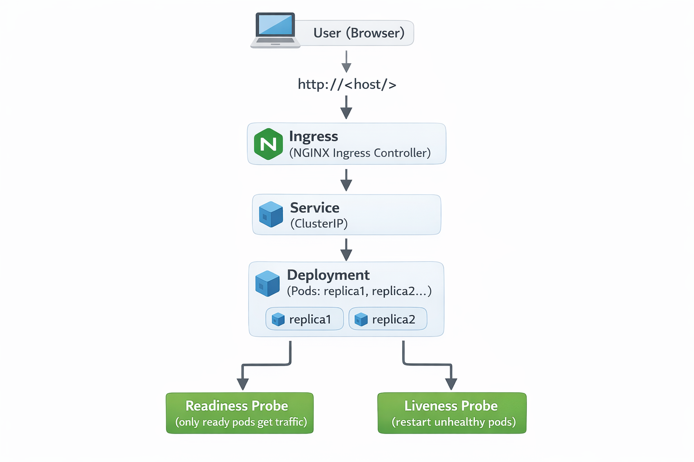
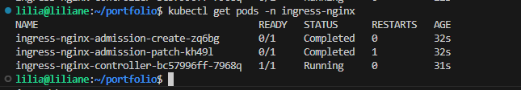
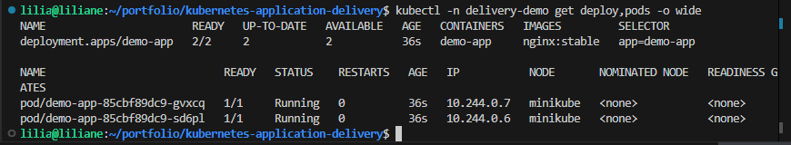
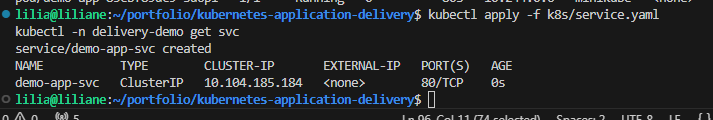
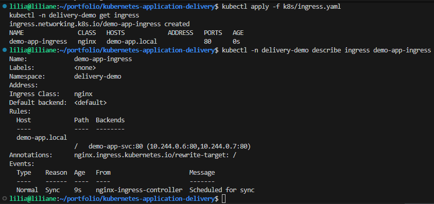
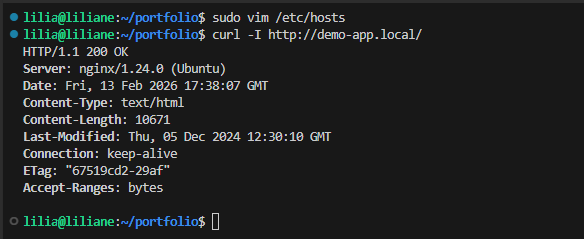
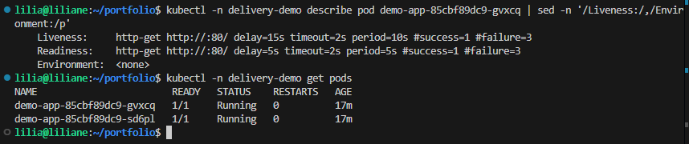
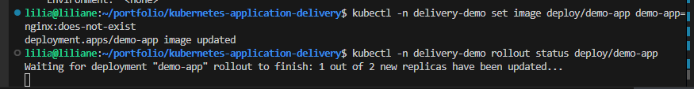
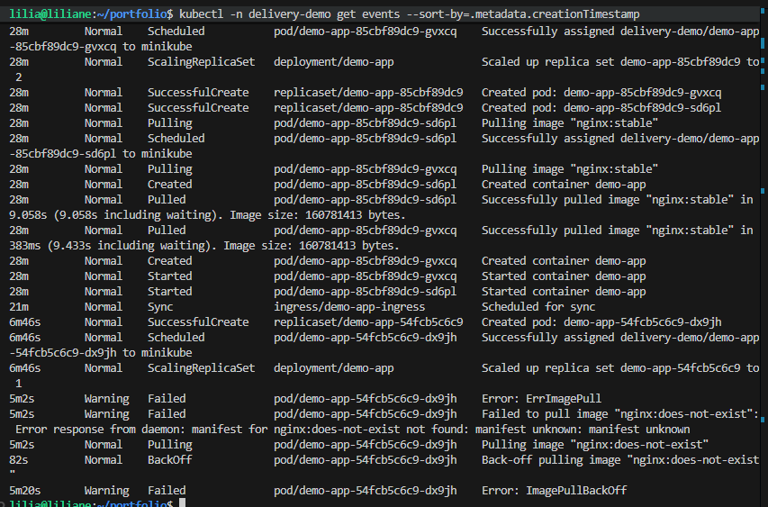

# Kubernetes Application Delivery

## Context

In a real Ops environment, deploying an application is not just about making the container run. It must be delivered in a way that is stable, reachable, and easy to troubleshoot.

For this project, I used a Kubernetes delivery pattern that reflects how I would expose and protect an application in a real platform setup. I deployed the app with a **Deployment**, exposed it internally with a **Service**, published it externally using **Ingress (NGINX)**, and protected availability with **readiness and liveness probes**.

This project shows how I deliver an application in Kubernetes while making sure users only hit healthy pods and that troubleshooting stays simple during incidents.

---

## Problem

In production, just having a pod in a **Running** state does not mean the application is actually ready for users.

Common delivery problems include:

* The application starts slowly but receives traffic too early
* A container becomes unhealthy but is still left running
* The application is deployed internally but is not exposed cleanly to users
* Rollouts fail and there is no quick visibility into what is wrong
* Teams need a repeatable delivery pattern that is easy to validate and support

Without a proper Kubernetes delivery design, these issues can cause failed releases, bad user experience, and longer troubleshooting time.

---

## Solution

I built a Kubernetes application delivery workflow based on the core components used in real environments:

* **Deployment** to manage the application lifecycle and replicas
* **Service (ClusterIP)** to give the app stable internal networking
* **Ingress (NGINX)** to expose the app through a clean route
* **Readiness probe** to stop traffic from reaching pods before they are ready
* **Liveness probe** to restart unhealthy containers automatically
* **Rolling update behavior** to support safer deployments

This setup creates a cleaner and more production-aligned delivery pattern for Kubernetes applications.

---

## Architecture



---

## Workflow

### 1. Enable the Ingress controller

**Goal:** Make sure the cluster can process Ingress rules before exposing the application externally.

In this project, the first important step was confirming that the **NGINX Ingress Controller** was running correctly in the cluster. Without it, the Ingress resource would exist, but external routing would not actually work.

#### Screenshot



---

### 2. Deploy the application with health protection

**Goal:** Run the application with replicas and make sure Kubernetes can decide when pods are ready or unhealthy.

I deployed the application using a Kubernetes **Deployment**. This is the core delivery object that manages the pods and keeps the desired number of replicas running.

I also included **readiness** and **liveness probes** so that:

* the pod does not receive traffic before it is ready
* the container is restarted automatically if it becomes unhealthy

This is one of the most important parts of safe application delivery in Kubernetes.

#### Screenshot



---

### 3. Expose the application internally with a Service

**Goal:** Give the application a stable internal endpoint inside the cluster.

After the Deployment was running, I exposed it through a **Service**. This allowed Kubernetes to route traffic to the correct pods through a stable internal name and IP abstraction.

This step is important because pods are temporary, but the Service provides a consistent access point.

#### Screenshot



---

### 4. Publish the application externally with Ingress

**Goal:** Make the application reachable from outside the cluster using clean routing.

I used **Ingress** with NGINX so the application could be accessed externally through a simple host/path pattern instead of exposing pods directly.

This is closer to how applications are published in a real Kubernetes platform, where routing is centralized and controlled.

#### Screenshot



---

### 5. Validate browser access

**Goal:** Confirm the external route works the way a user would experience it.

Once the Ingress was in place, I validated that the application was reachable successfully from the browser.

This step proves that the full delivery chain is working:

* Deployment
* Service
* Ingress
* external access

#### Screenshot



---

### 6. Confirm readiness and liveness behavior

**Goal:** Verify that Kubernetes is actively checking pod health.

I validated the pod health configuration to confirm that readiness and liveness probes were present and working as expected.

This is important because a pod being “Running” is not enough. I wanted proof that Kubernetes had actual health-check logic protecting traffic and availability.

#### Screenshot



---

### 7. Simulate a bad rollout

**Goal:** Show how Kubernetes behaves when a deployment update goes wrong.

To make this more realistic, I simulated a failed rollout. This is the kind of issue that can happen during real releases when an image is incorrect or the app version is broken.

This step shows the operational value of watching rollout status and validating deployments before they fully impact users.

#### Screenshot



---

### 8. Investigate events for troubleshooting

**Goal:** Use Kubernetes events to understand delivery failures quickly.

When something goes wrong in Kubernetes, **events** are often the fastest way to understand what the platform is reporting.

I used events to investigate the rollout behavior and delivery issues. This helps reduce guessing and gives direct visibility into scheduling, image pull, probe, or routing problems.

#### Screenshot



---

## Business Impact

This project reflects the way application delivery should work in a real Kubernetes environment.

The business value is:

* **Better uptime** because unhealthy pods are automatically handled
* **Safer releases** through readiness/liveness protection and rollout visibility
* **Cleaner external access** using Ingress instead of ad hoc exposure
* **Faster incident response** because troubleshooting is structured
* **More consistent deployments** through a repeatable Kubernetes delivery pattern

In short, this reduces deployment risk and improves reliability for production applications.

---

## Troubleshooting

### Ingress is created but routing does not work

This usually means the Ingress controller is not running correctly, the rule is not applied as expected, or local routing is not mapped properly.

### Browser access fails

This may happen if hostname mapping is wrong, the Ingress is not configured correctly, or the controller is not serving the route.

### Pods are running but not Ready

This often means the readiness probe is failing, the application is still starting, or the health endpoint is incorrect.

### Service exists but traffic does not reach pods

This usually happens when the Service selector does not match the pod labels.

### Rollout gets stuck

This can happen when the image is wrong, the probes fail, or the new version cannot start correctly.

### Delivery fails and cause is unclear

Kubernetes events are one of the first places I check because they usually show exactly what the platform is unhappy about.

---

## Useful CLI

### General validation

```bash
kubectl get pods -A
kubectl get svc -A
kubectl get ingress -A
kubectl get deploy -A
```

### Check ingress controller

```bash
kubectl get pods -n ingress-nginx
kubectl get svc -n ingress-nginx
```

### Check application resources

```bash
kubectl -n delivery-demo get deploy,pods,svc,ingress
kubectl -n delivery-demo describe ingress demo-app-ingress
kubectl -n delivery-demo describe svc demo-app-svc
kubectl -n delivery-demo describe deploy demo-app
```

### Check pod health

```bash
kubectl -n delivery-demo describe pod -l app=demo-app
kubectl -n delivery-demo logs -l app=demo-app --tail=100
kubectl -n delivery-demo get pods
```

### Check rollout status

```bash
kubectl -n delivery-demo rollout status deploy/demo-app
kubectl -n delivery-demo rollout history deploy/demo-app
kubectl -n delivery-demo rollout undo deploy/demo-app
```

### Check events for troubleshooting

```bash
kubectl -n delivery-demo get events --sort-by=.metadata.creationTimestamp
```

### Confirm service selector and pod labels

```bash
kubectl -n delivery-demo describe svc demo-app-svc
kubectl -n delivery-demo get pods --show-labels
```

### Local access testing

```bash
curl -I http://demo-app.local/
minikube ip
```

---

## Cleanup

When I am done with the project, I remove the namespace and any test resources created for the delivery demo.

```bash
kubectl delete namespace delivery-demo
```

If using Minikube and I want to fully stop the local cluster:

```bash
minikube stop
```

If I want to remove the full local cluster:

```bash
minikube delete
```

